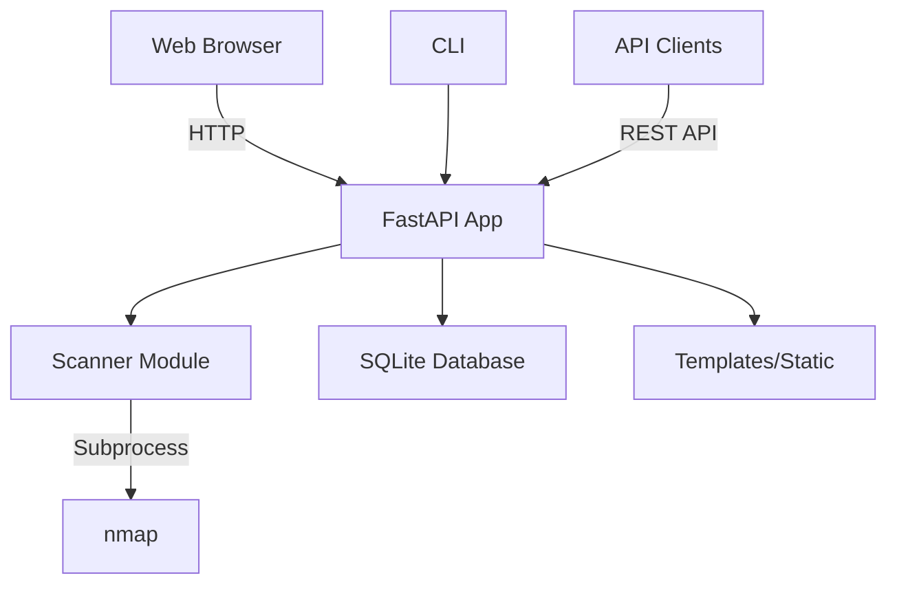
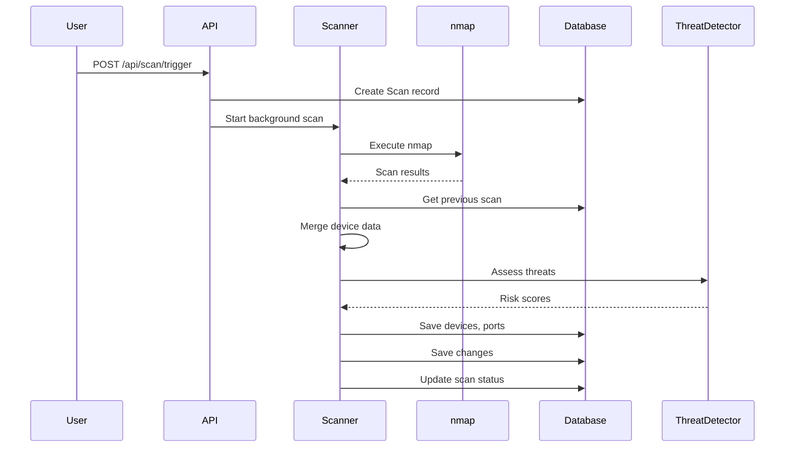
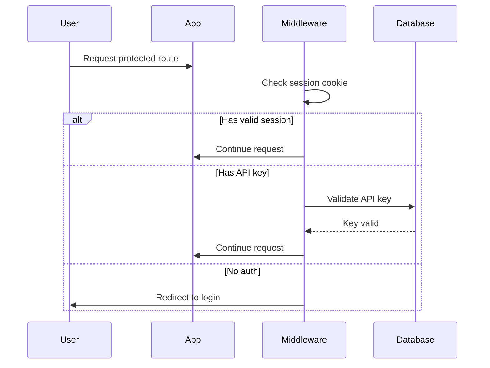

# Architecture

This document describes the technical architecture of Argus.

## Overview

Argus is a Python web application built with FastAPI. It uses nmap for network scanning and SQLite for data persistence.



## Components

### FastAPI Application (`app/main.py`)

The main application handles:

- HTTP routing (web UI and API)
- Authentication middleware
- Request/response processing
- Background task management

### Scanner Module (`app/scanner.py`)

Wraps python-nmap to perform network scans:

- Manages nmap subprocess execution
- Parses scan results
- Merges data with previous scans
- Triggers threat assessment

### Database Layer (`app/database.py`, `app/models.py`)

SQLAlchemy ORM with SQLite:

- `Scan` - Scan metadata
- `Device` - Discovered devices
- `Port` - Open ports per device
- `Change` - Detected changes
- `DeviceHistory` - Persistent device tracking
- `User` - Admin users
- `APIKey` - API authentication
- `AuditLog` - Security events

### Authentication (`app/auth.py`)

Two authentication methods:

1. **Session-based**: Cookie with signed JWT-like token
2. **API Key**: SHA-256 hashed keys in database

### Threat Detection (`app/utils/threat_detector.py`)

Analyzes devices for security risks:

- Port-based threat database
- CVE matching for common services
- Risk score calculation
- Remediation recommendations

### Change Detection (`app/utils/change_detector.py`)

Compares scans to detect:

- New devices
- Removed devices
- Port changes
- Service changes

## Data Flow

### Network Scan Flow



### Authentication Flow



## Directory Structure

```
argus/
├── app/
│   ├── __init__.py
│   ├── main.py              # FastAPI app, routes
│   ├── models.py            # SQLAlchemy models
│   ├── database.py          # DB connection, session
│   ├── scanner.py           # NetworkScanner class
│   ├── auth.py              # Authentication helpers
│   ├── audit.py             # Audit logging
│   ├── config.py            # Configuration management
│   ├── scheduler.py         # APScheduler integration
│   ├── version.py           # Version management
│   ├── update_checker.py    # GitHub release checker
│   └── utils/
│       ├── change_detector.py
│       ├── threat_detector.py
│       ├── mac_vendor.py    # MAC vendor lookup
│       ├── device_icons.py  # Device type detection
│       └── cve_database.py  # CVE matching
├── templates/               # Jinja2 templates
│   ├── base.html           # Base template
│   ├── dashboard.html
│   ├── devices.html
│   ├── device_detail.html
│   ├── scans.html
│   ├── changes.html
│   ├── settings.html
│   ├── login.html
│   └── setup.html
├── static/
│   ├── argus_logo.png
│   └── ...
├── tests/
│   ├── test_api_keys.py
│   ├── test_models.py
│   └── ...
├── data/                    # Database storage
│   └── argus.db
├── docs/                    # MkDocs documentation
├── config.yaml              # Runtime configuration
├── requirements.txt
├── Dockerfile
└── docker-compose.yml
```

## Key Technologies

| Component | Technology | Purpose |
|-----------|------------|---------|
| Web Framework | FastAPI | Async HTTP handling |
| Templates | Jinja2 | Server-side rendering |
| Database | SQLite + SQLAlchemy | Data persistence |
| Scanner | python-nmap | Network scanning |
| Frontend | Tailwind CSS | Styling |
| Interactivity | Alpine.js, htmx | Dynamic UI |
| Charts | Chart.js | Data visualization |
| Auth | itsdangerous | Session tokens |
| Scheduling | APScheduler | Cron-like scans |

## Security Model

### Authentication

- Session cookies with HMAC signing
- API keys with SHA-256 hashing
- No plain-text credential storage

### Authorization

- Single admin user model
- All authenticated users have full access
- API keys have same privileges as sessions

### Audit Trail

All security-relevant actions are logged:

- Login attempts (success/failure)
- Configuration changes
- Scan operations
- Device modifications
- API key management

## Scaling Considerations

Argus is designed for home/small office networks:

- SQLite is sufficient for typical use
- Single-process model
- In-memory caching where appropriate

For larger deployments, consider:

- PostgreSQL for database
- Redis for caching
- Celery for background tasks
- Multiple scanner instances

## Extension Points

### Adding New Scan Types

1. Add profile in `scanner.py`
2. Configure nmap arguments
3. Update UI options

### Adding New Threat Rules

1. Add entries to `THREAT_DATABASE` in `threat_detector.py`
2. Update CVE database if needed

### Adding New Alert Channels

1. Create alert handler module
2. Register in configuration
3. Trigger from change detector

### Custom Integrations

Use the REST API to integrate with:

- Home automation (Home Assistant)
- Monitoring (Grafana, Prometheus)
- Alerting (Slack, Discord, PagerDuty)
- SIEM systems
