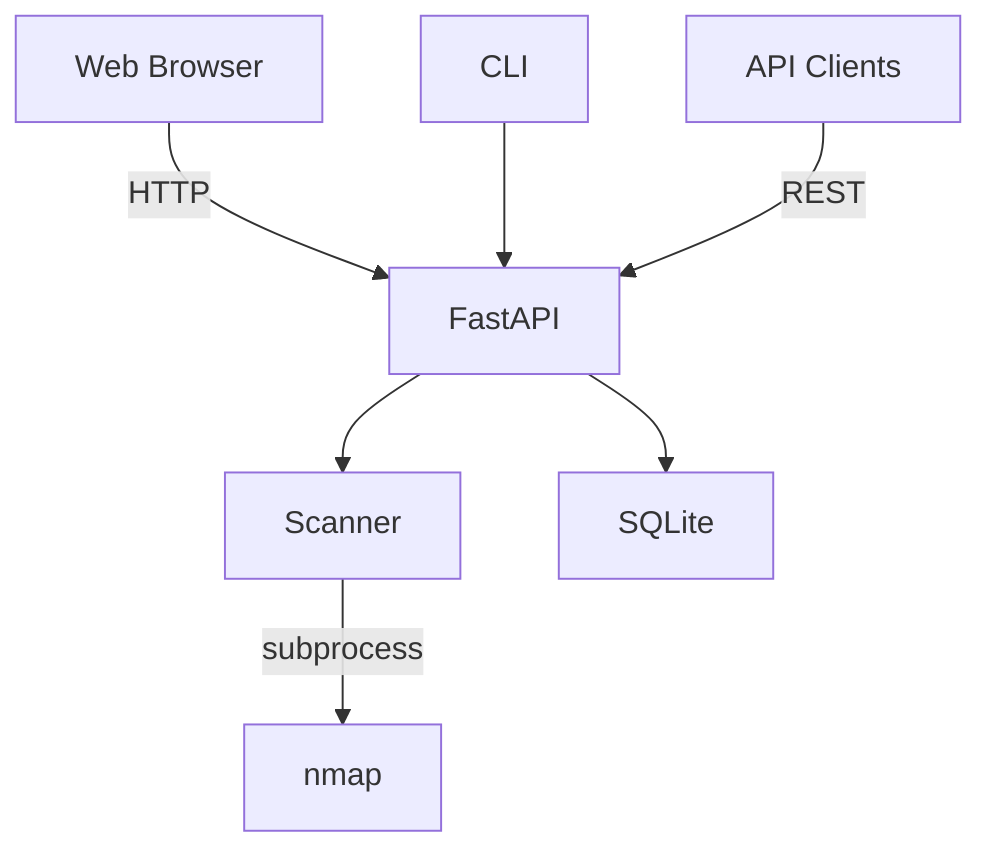
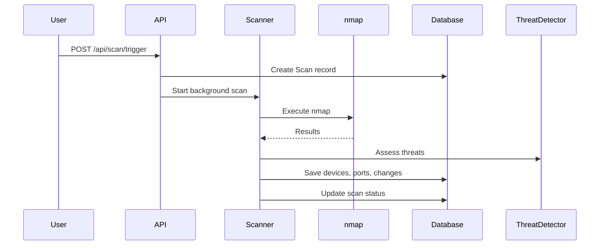

# Architecture

## Overview



## Stack

| Component | Technology |
|-----------|------------|
| Web Framework | FastAPI |
| Templates | Jinja2 |
| Database | SQLite + SQLAlchemy |
| Scanner | python-nmap |
| Frontend | Tailwind, Alpine.js, htmx |
| Charts | Chart.js |
| Scheduling | APScheduler |

## Components

### FastAPI (`app/main.py`)

- HTTP routing (web + API)
- Auth middleware
- Background task management

### Scanner (`app/scanner.py`)

- nmap subprocess execution
- Result parsing
- Data merging with previous scans
- Threat assessment trigger

### Database (`app/models.py`)

| Model | Purpose |
|-------|---------|
| `Scan` | Scan metadata |
| `Device` | Discovered hosts |
| `Port` | Open ports per device |
| `Change` | Detected changes |
| `DeviceHistory` | Persistent tracking by MAC |
| `User` | Admin accounts |
| `APIKey` | API authentication |
| `AuditLog` | Security events |

### Threat Detection (`app/utils/threat_detector.py`)

- Port-based risk scoring
- CVE matching for common services
- Remediation recommendations

### Change Detection (`app/utils/change_detector.py`)

Compares scans for:
- Device additions/removals
- Port state changes
- Service version changes

## Data Flow



## Auth

- **Sessions**: Signed cookies
- **API Keys**: SHA-256 hashed in DB

Single admin user model. All authenticated users have full access.

## Directory Structure

```
app/
├── main.py              # Routes
├── models.py            # ORM models
├── database.py          # DB session
├── scanner.py           # NetworkScanner
├── auth.py              # Auth helpers
├── config.py            # Settings
└── utils/
    ├── change_detector.py
    ├── threat_detector.py
    └── mac_vendor.py
templates/               # Jinja2
static/                  # Assets
tests/                   # Pytest
data/                    # SQLite DB
```

## Extension Points

### New Scan Profiles

Add profile in `scanner.py` with nmap arguments.

### New Threat Rules

Add to `THREAT_DATABASE` in `threat_detector.py`.

### Integrations

Use REST API for:
- Home Assistant
- Grafana/Prometheus
- Slack/Discord alerts
- SIEM ingestion
