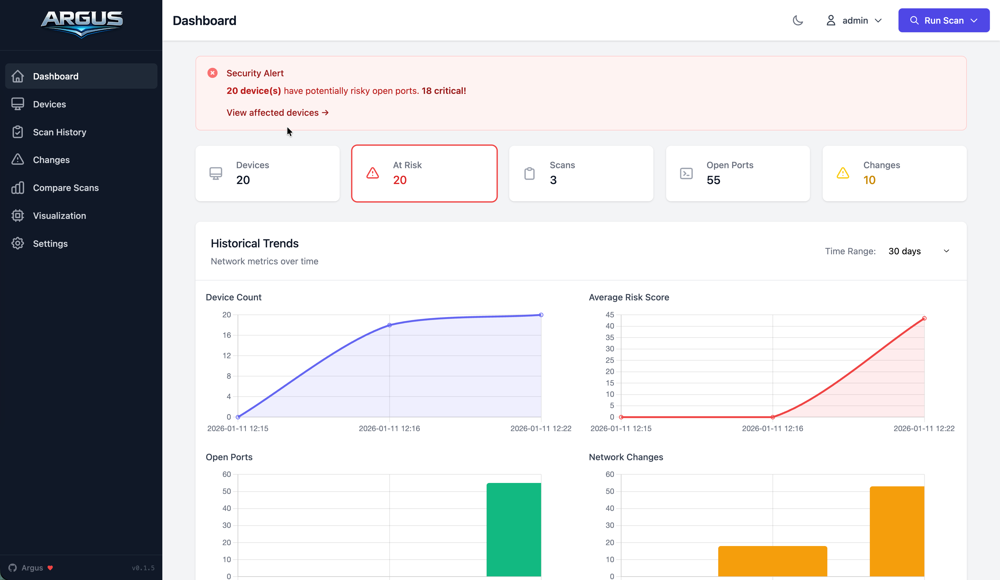

# Dashboard

Overview of your network's current state.

## Metrics

| Card | Description |
|------|-------------|
| Total Devices | Unique devices discovered |
| At Risk | Devices with Medium+ risk |
| Critical/High | Immediate attention needed |
| Last Scan | Most recent scan timestamp |

## Charts

Historical data with selectable time range (7d, 30d, 90d, 1y):

- **Device Count** - Track network growth
- **Average Risk** - Security posture over time
- **Open Ports** - Total exposed services
- **Changes** - Network churn rate

## Latest Scan

Shows the most recent scan with status, subnet, and device count.

## Device Table

Quick view of discovered devices with risk indicator, IP, hostname, vendor, and port count. Click any row for details.

## Recent Changes

| Type | Description |
|------|-------------|
| Device Added | New host appeared |
| Device Removed | Host no longer responding |
| Port Opened | New service exposed |
| Port Closed | Service no longer accessible |
| Service Changed | Version or product changed |

## Actions

- **Run Scan** - Trigger manual scan
- **Dark Mode** - Toggle theme
