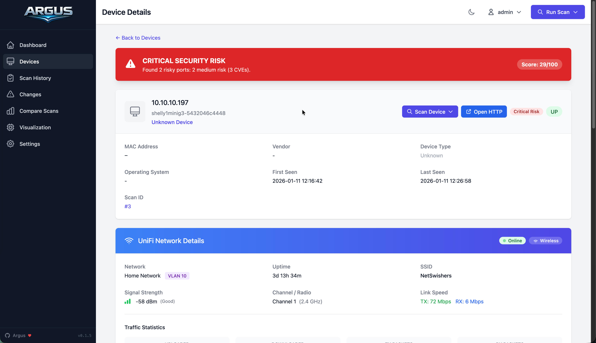

# Devices

Device inventory and management.

## Device List

| Column | Description |
|--------|-------------|
| Risk | Security risk level |
| IP | Network address |
| Hostname | DNS/NetBIOS name |
| Label | Your custom name |
| Vendor | OUI-based manufacturer |
| Zone | Network segment |
| Ports | Open port count |

## Filters

- **Search** - IP, hostname, MAC, vendor, label
- **Risk Level** - Critical, High, Medium, Low, None
- **Trusted** - All, Trusted only, Untrusted only
- **Zone** - Filter by assigned zone
- **Port** - Find devices with specific ports (e.g., `22`, `80,443`)

## Quick Actions

Context menu (⋮) on each row:

- Copy IP/MAC
- Scan this device
- Toggle trusted
- View details

## Device Details

### Info

- IP, MAC, Hostname, Vendor
- OS (if detected)
- First seen / Last seen
- Risk score and level

### Ports

| Field | Description |
|-------|-------------|
| Port | Number and protocol |
| State | open, filtered, etc. |
| Service | Service name |
| Product | Software |
| Version | Software version |

### Security

- **Threat Summary** - Human-readable risk assessment
- **Risk Details** - Breakdown of risk factors
- **Recommendations** - Actionable remediation steps
- **CVEs** - Known vulnerabilities for detected services

### Settings

| Field | Description |
|-------|-------------|
| Label | Friendly name (e.g., `proxmox-01`) |
| Zone | Network segment (e.g., `Servers`, `DMZ`) |
| Trusted | Mark as known/expected |
| Notes | Free-form notes |

## Zones

Suggested zones for homelab:

| Zone | Use |
|------|-----|
| `Servers` | NAS, hypervisors, Docker hosts |
| `Network` | Routers, switches, APs, firewalls |
| `Workstations` | Desktops, laptops |
| `IoT` | Smart devices, sensors |
| `DMZ` | Internet-exposed services |
| `Management` | IPMI, iLO, iDRAC |
| `Storage` | SAN, backup targets |
