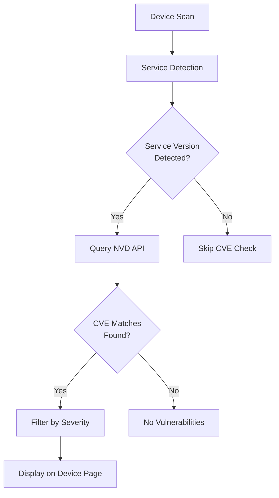

# CVE Database

Match detected services against known vulnerabilities from the National Vulnerability Database (NVD).

## Features

- :material-bug: CVE matching for detected services
- :material-alert-circle: CVSS severity scores
- :material-text-box: Vulnerability descriptions
- :material-link: Links to detailed CVE information
- :material-tag: Affected version range detection

## Configuration

| Field | Description | Example |
|-------|-------------|---------|
| **NVD API Key** | Optional API key | `your-api-key` |
| **Minimum Severity** | Filter threshold | `MEDIUM` |
| **Cache Duration** | Hours to cache data | `24` |
| **Check on Scan** | Auto-check during scans | Recommended |

## NVD API Key

Get a free API key from [NVD](https://nvd.nist.gov/developers/request-an-api-key) for better rate limits:

| | Without Key | With Key |
|------|-------------|----------|
| **Rate Limit** | 5 requests / 30s | 50 requests / 30s |
| **Performance** | Slower lookups | 10x faster |
| **Reliability** | May hit limits | Consistent |

!!! tip "Highly Recommended"
    While optional, the API key significantly improves CVE lookup performance, especially for networks with many services.

## Severity Levels

Filter CVEs by minimum severity:

| Level | CVSS Score | Color |
|-------|------------|-------|
| :material-alert-circle:{ .text-red } **CRITICAL** | 9.0 - 10.0 | Red |
| :material-alert:{ .text-orange } **HIGH** | 7.0 - 8.9 | Orange |
| :material-alert-outline:{ .text-yellow } **MEDIUM** | 4.0 - 6.9 | Yellow |
| :material-information:{ .text-blue } **LOW** | 0.1 - 3.9 | Blue |

!!! info "Default: MEDIUM"
    By default, Argus shows CVEs with MEDIUM severity or higher. Set to LOW to see all vulnerabilities.

## How CVE Matching Works

!!! warning "Version Detection Required"
    CVE matching requires accurate service version detection. Use **Normal** or **Intensive** scan profiles for best results. Quick scans don't detect service versions.

## What You'll See

On the device detail page, the **Vulnerabilities** section shows:

| Field | Description |
|-------|-------------|
| **CVE ID** | Unique identifier (e.g., CVE-2024-1234) |
| **Service** | Affected service name and version |
| **Severity** | CVSS score and level |
| **Description** | Brief vulnerability description |
| **Published** | When CVE was published |
| **Link** | Link to full NVD details |

## Cache Duration

CVE data is cached to reduce API calls:

| Duration | Best For |
|----------|----------|
| **1-6 hours** | Active security monitoring |
| **12-24 hours** | Regular homelab use (default) |
| **48-168 hours** | Infrequent scanning |

!!! note "Cache Refresh"
    Cache is per-service. Different services on different devices maintain separate caches.

## Setup Checklist

- [ ] Request NVD API key (optional but recommended)
- [ ] Configure integration in Argus Settings
- [ ] Set minimum severity threshold
- [ ] Set cache duration
- [ ] Enable Check on Scan
- [ ] Run a Normal or Intensive scan to test

??? question "Troubleshooting: No CVEs Found"

    **Service versions not detected**

    - Use Normal or Intensive scan profile
    - Quick scans don't detect versions
    - Some services hide version info

    **False negatives**

    - NVD may not have CVEs for all software
    - Version string must match NVD format
    - Check NVD directly for the service

??? question "Troubleshooting: Rate Limited"

    **Too many requests error**

    - Get an NVD API key (free)
    - Increase cache duration
    - Reduce scan frequency

    **Slow CVE lookups**

    - This is normal without API key
    - API key provides 10x faster lookups
    - First scan is slowest (cold cache)

??? info "Supported Services"
    CVE matching works best with common services:

    - SSH (OpenSSH)
    - HTTP servers (Apache, nginx, IIS)
    - SMB/CIFS
    - RDP
    - Database servers (MySQL, PostgreSQL)
    - Mail servers (Postfix, Dovecot)

    Proprietary and IoT device services may have limited CVE coverage.
