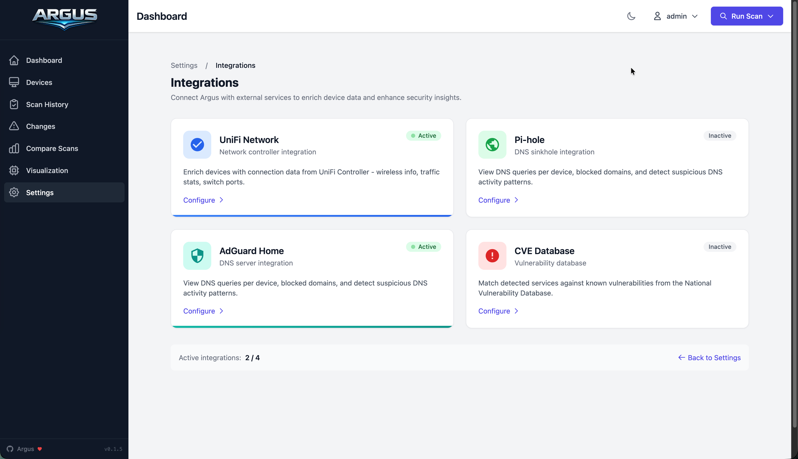
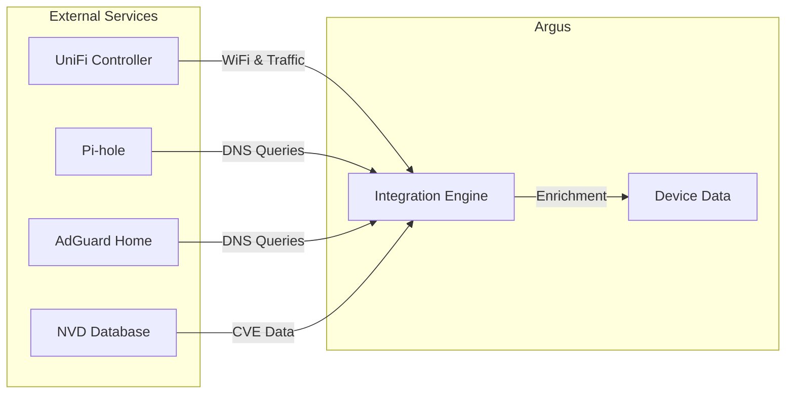

# Integrations

Extend Argus by connecting external services to enrich device data and enhance security insights.

## Available Integrations

-   :material-router-wireless: **UniFi Network**

    ---

    Import device data from Ubiquiti UniFi Controller

    - WiFi info (SSID, signal, channel)
    - Traffic statistics
    - Switch port mapping

    [:octicons-arrow-right-24: Configure UniFi](unifi.md)

-   :material-dns: **Pi-hole**

    ---

    Enrich devices with DNS query data

    - DNS queries per device
    - Blocked domains tracking
    - DNS risk scoring

    [:octicons-arrow-right-24: Configure Pi-hole](pihole.md)

-   :material-shield-check: **AdGuard Home**

    ---

    DNS filtering and query analytics

    - DNS queries per device
    - Blocked domains tracking
    - Suspicious domain detection

    [:octicons-arrow-right-24: Configure AdGuard](adguard.md)

-   :material-bug: **CVE Database**

    ---

    Match services against known vulnerabilities

    - CVE matching for services
    - CVSS severity scores
    - Remediation guidance

    [:octicons-arrow-right-24: Configure CVE](cve.md)

## How Integrations Work

## Accessing Integrations

Navigate to **Settings** :octicons-arrow-right-16: **External Integrations** :octicons-arrow-right-16: **Manage Integrations** to view and configure all available integrations.

!!! tip "Sync on Scan"
    Enable **Sync on Scan** for each integration to automatically fetch the latest data during network scans.

## Integration Status

Each integration shows its current status:

| Status | Description |
|--------|-------------|
| :material-check-circle:{ .text-green } **Active** | Integration enabled and configured |
| :material-close-circle:{ .text-red } **Inactive** | Integration disabled or not configured |
| :material-sync:{ .text-blue } **Syncing** | Currently fetching data |

## DNS Risk Scoring

Both Pi-hole and AdGuard integrations calculate a **DNS Risk Score** (0-100) based on device behavior:

| Factor | Impact |
|--------|--------|
| High blocked percentage (>50%) | +30 points |
| Suspicious domains detected | +10 points each |
| Very high query volume | +10 points |
| Known malware domains | +20 points |

??? info "Suspicious Domain Detection"
    Argus flags domains that match patterns commonly used by malware:

    - Random-looking subdomains (high entropy)
    - Known malicious TLDs
    - Cryptocurrency mining pools
    - Command & control patterns
