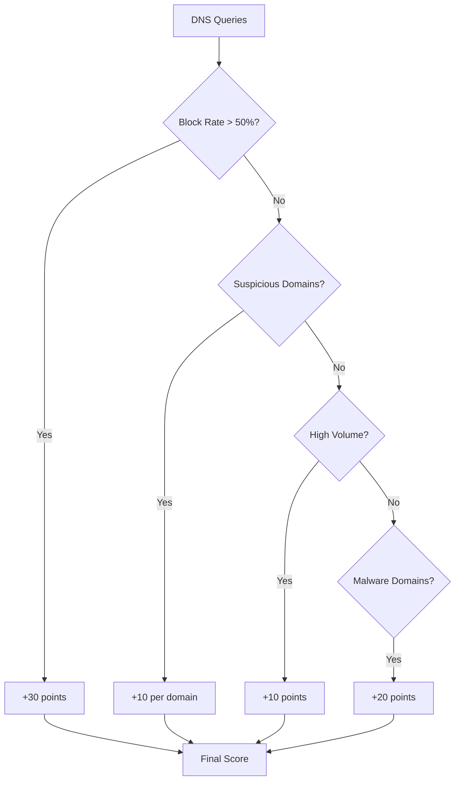

# Pi-hole

Enrich devices with DNS query data from Pi-hole (supports v5 and v6).

## Features

- :material-dns: DNS queries per device (24h)
- :material-cancel: Blocked queries and block rate
- :material-format-list-bulleted: Top queried domains
- :material-alert: Suspicious domain detection
- :material-gauge: DNS behavior risk scoring

## Configuration

| Field | Description | Example |
|-------|-------------|---------|
| **Pi-hole URL** | URL to your Pi-hole | `http://pi.hole` |
| **API Token** | Optional authentication | See below |
| **Verify SSL** | Validate SSL certificate | Enable for HTTPS |
| **Sync on Scan** | Auto-fetch during scans | Recommended |

!!! note "URL Format"
    - **Local hostname**: `http://pi.hole`
    - **IP address**: `http://192.168.1.2`
    - **Custom port**: `http://192.168.1.2:8080`

## API Token

=== "Pi-hole v5"

    Find your API token in **Settings** :octicons-arrow-right-16: **API** :octicons-arrow-right-16: **Show API token**

    The token is a 64-character hex string.

=== "Pi-hole v6"

    Create an app password in **Settings** :octicons-arrow-right-16: **Privacy**

    !!! tip "App Passwords"
        Pi-hole v6 uses app passwords instead of the web password hash. Create a dedicated password for Argus.

!!! info "Token Optional"
    The API token is optional but recommended. Without it, some data may not be accessible depending on your Pi-hole privacy settings.

## What You'll See

On the device detail page, a new **DNS Activity** section shows:

| Metric | Description |
|--------|-------------|
| **Total Queries** | DNS queries in last 24 hours |
| **Blocked Count** | Number of blocked queries |
| **Block Percentage** | Ratio of blocked to total |
| **DNS Risk Score** | Calculated risk (0-100) |
| **Top Domains** | 10 most queried domains |
| **Blocked Domains** | List of blocked queries |
| **Suspicious Domains** | Flagged suspicious activity |

## DNS Risk Scoring

Argus calculates a DNS Risk Score based on device behavior:

## Setup Checklist

- [x] Pi-hole running and accessible
- [ ] Note the Pi-hole URL
- [ ] Get API token (optional but recommended)
- [ ] Configure integration in Argus Settings
- [ ] Test connection
- [ ] Enable Sync on Scan

??? question "Troubleshooting: Connection Failed"

    **Connection refused**

    - Verify Pi-hole is running: `pihole status`
    - Check the URL is correct (include port if non-standard)
    - Ensure no firewall blocking the connection

    **Authentication failed**

    - Re-copy the API token from Pi-hole settings
    - For v6, ensure you're using an app password, not web password
    - Try without token to test connectivity first

??? question "Troubleshooting: No Data for Devices"

    **Empty DNS data**

    - Devices must use Pi-hole as their DNS server
    - Check Pi-hole has queries from the device IP
    - DNS data is from last 24 hours only

    **Privacy settings**

    - Pi-hole privacy settings may hide client data
    - Set to "Show everything" temporarily for testing
