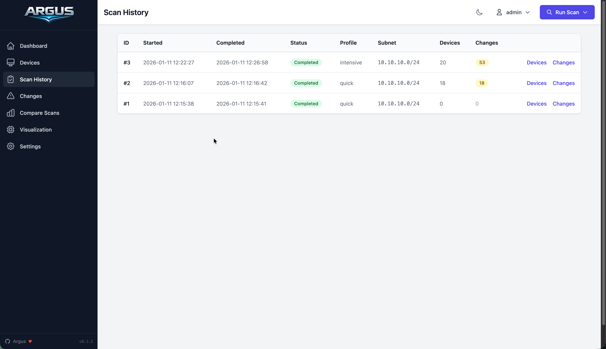

# Scans

Network scanning with nmap.



## Profiles

| Profile | nmap Command | Use Case |
|---------|--------------|----------|
| `quick` | `nmap -sn -T4` | Device discovery, frequent checks |
| `normal` | `nmap -sV -T4 -p 1-1000` | Daily security audits |
| `intensive` | `nmap -A -T4` | Deep analysis, initial baseline |

## Running Scans

### Web UI

Click **Run Scan** in navigation, select profile.

### CLI

```bash
python scan_cli.py scan --profile quick
python scan_cli.py scan --profile normal --detect-changes
python scan_cli.py scan --subnet 10.0.0.0/24 --profile intensive
```

### API

```bash
curl -X POST "http://localhost:8080/api/scan/trigger?profile=quick"
curl -X POST "http://localhost:8080/api/scan/trigger?profile=normal&subnet=10.0.0.0/24"
```

## Scan History

View past scans with:

- Timestamp
- Status (Completed, Running, Failed)
- Profile used
- Subnet scanned
- Device count

Click any scan to view its device snapshot.

## Compare Scans

Select two scans to see:

- Devices added/removed
- Port changes
- Service changes

## Change Detection

Enabled via `--detect-changes` flag or UI toggle.

| Change Type | Description |
|-------------|-------------|
| `device_added` | New host on network |
| `device_removed` | Host no longer responding |
| `port_opened` | New service exposed |
| `port_closed` | Service stopped |
| `service_changed` | Version/product update |

## Scheduling

### Cron

```bash
# Quick every 6h
0 */6 * * * cd /opt/argus && python scan_cli.py scan --profile quick --detect-changes

# Normal nightly at 2am
0 2 * * * cd /opt/argus && python scan_cli.py scan --profile normal --detect-changes

# Intensive weekly (Sunday 3am)
0 3 * * 0 cd /opt/argus && python scan_cli.py scan --profile intensive --detect-changes
```

### Docker

```yaml
environment:
  - SCAN_SCHEDULE=0 2 * * *
```

### Web UI

Settings → Scheduled Scans → Add Schedule

Cron expression examples:

| Expression | Schedule |
|------------|----------|
| `0 2 * * *` | Daily 2am |
| `0 */6 * * *` | Every 6h |
| `0 2 * * 0` | Sunday 2am |
| `*/30 * * * *` | Every 30min |
