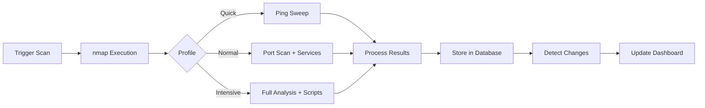

# Scans

Network scanning with nmap.


## How Scanning Works



---

## Scan Profiles

| Profile | nmap Command | Use Case | Duration |
|---------|--------------|----------|----------|
| :material-flash: **Quick** | `nmap -sn -T4` | Device discovery | ~30 seconds |
| :material-shield-search: **Normal** | `nmap -sV -T4 -p 1-1000` | Security audits | 3-5 minutes |
| :material-magnify: **Intensive** | `nmap -A -T4` | Deep analysis | 15-30 minutes |

!!! info "Profile Selection Guide"
    - **Quick**: Use for frequent checks (hourly/daily) - just confirms devices are online
    - **Normal**: Use for security monitoring (daily/weekly) - detects open ports and services
    - **Intensive**: Use sparingly (weekly/monthly) - full OS detection and vulnerability scripts

---

## Running Scans

=== "Web UI"

    1. Click **Run Scan** in the navigation bar
    2. Select scan profile
    3. (Optional) Override subnet
    4. Monitor progress in real-time

    !!! tip "Real-time Progress"
        The UI shows live scan progress including current host and discovered devices.

=== "CLI"

    ```bash
    # Quick scan
    python scan_cli.py scan --profile quick

    # Normal scan with change detection
    python scan_cli.py scan --profile normal --detect-changes

    # Custom subnet
    python scan_cli.py scan --subnet 10.0.0.0/24 --profile intensive
    ```

    Press ++ctrl+c++ to cancel a running scan gracefully.

=== "API"

    ```bash
    # Trigger scan
    curl -X POST "http://localhost:8080/api/scan/trigger?profile=quick"

    # Custom subnet
    curl -X POST "http://localhost:8080/api/scan/trigger?profile=normal&subnet=10.0.0.0/24"

    # Check status
    curl http://localhost:8080/api/scan/status
    ```

---

## Scan History

View past scans with:

| Column | Description |
|--------|-------------|
| :material-clock: **Timestamp** | When scan completed |
| :material-check-circle: **Status** | Completed, Running, Failed |
| :material-cog: **Profile** | Quick, Normal, Intensive |
| :material-ip-network: **Subnet** | Network range scanned |
| :material-devices: **Devices** | Number of hosts found |

Click any scan to view its device snapshot at that point in time.

---

## Compare Scans

Select two scans to see differences:

| Change Type | Description |
|-------------|-------------|
| :material-plus-circle:{ .text-green } **Devices Added** | New hosts appeared |
| :material-minus-circle:{ .text-red } **Devices Removed** | Hosts disappeared |
| :material-lan-connect:{ .text-orange } **Ports Opened** | New services detected |
| :material-lan-disconnect:{ .text-blue } **Ports Closed** | Services stopped |
| :material-swap-horizontal:{ .text-yellow } **Service Changed** | Version/product updates |

!!! tip "Baseline Comparison"
    Compare your latest scan to a known-good baseline to quickly identify unexpected changes.

---

## Change Detection

Enable change detection to track network modifications over time.

### How to Enable

=== "CLI"

    Add the `--detect-changes` flag:
    ```bash
    python scan_cli.py scan --profile normal --detect-changes
    ```

=== "Web UI"

    Toggle **Detect Changes** when starting a scan.

=== "Scheduled"

    Changes are always detected for scheduled scans.

### Change Types

| Type | Trigger |
|------|---------|
| `device_added` | New MAC address seen |
| `device_removed` | MAC address not responding |
| `port_opened` | New port detected open |
| `port_closed` | Previously open port now closed |
| `service_changed` | Service name/version changed |

---

## Scheduling Scans

Automate regular network scanning.

=== "Cron (Manual Install)"

    ```bash
    # Quick scan every 6 hours
    0 */6 * * * cd /opt/argus && python scan_cli.py scan --profile quick --detect-changes

    # Normal scan nightly at 2 AM
    0 2 * * * cd /opt/argus && python scan_cli.py scan --profile normal --detect-changes

    # Intensive scan weekly (Sunday 3 AM)
    0 3 * * 0 cd /opt/argus && python scan_cli.py scan --profile intensive --detect-changes
    ```

=== "Docker"

    ```yaml title="docker-compose.yml"
    environment:
      - SCAN_SCHEDULE=0 2 * * *
    ```

=== "Web UI"

    **Settings** :octicons-arrow-right-16: **Scheduled Scans** :octicons-arrow-right-16: **Add Schedule**

### Cron Expression Reference

| Expression | Schedule |
|------------|----------|
| `0 2 * * *` | Daily at 2 AM |
| `0 */6 * * *` | Every 6 hours |
| `0 2 * * 0` | Sunday at 2 AM |
| `*/30 * * * *` | Every 30 minutes |
| `0 2 * * 1-5` | Weekdays at 2 AM |

!!! warning "Scan Frequency"
    - **Quick**: Safe to run frequently (hourly or more)
    - **Normal**: Recommended daily or every few hours
    - **Intensive**: Weekly or less - generates significant traffic

??? info "Cron Syntax Explained"
    ```
    ┌───────────── minute (0 - 59)
    │ ┌───────────── hour (0 - 23)
    │ │ ┌───────────── day of month (1 - 31)
    │ │ │ ┌───────────── month (1 - 12)
    │ │ │ │ ┌───────────── day of week (0 - 6, Sunday = 0)
    │ │ │ │ │
    * * * * *
    ```
