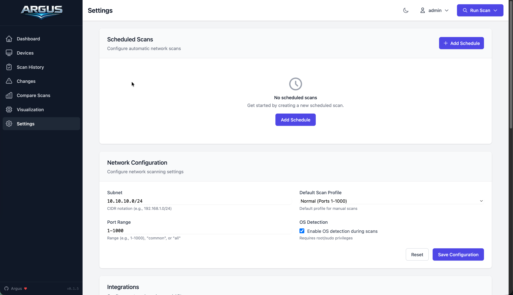

# Settings

Configuration and security management.



## Scheduled Scans

Create automated scan schedules:

1. Click **Add Schedule**
2. Set name, cron expression, profile
3. Enable/disable as needed

| Expression | Schedule |
|------------|----------|
| `0 2 * * *` | Daily 2am |
| `0 */6 * * *` | Every 6h |
| `0 2 * * 0` | Sunday 2am |

## Network Configuration

| Setting | Description |
|---------|-------------|
| Subnet | Target CIDR (e.g., `192.168.1.0/24`) |
| Default Scan Profile | quick, normal, or intensive |
| Port Range | `1-1000`, `1-65535`, `common`, or specific |
| OS Detection | Fingerprinting (requires root) |

## External Integrations

Connect Argus with external services to enrich device data. Navigate to **Manage Integrations** to configure:

- **UniFi Network** - WiFi info, traffic stats, switch ports
- **Pi-hole** - DNS queries, blocked domains
- **AdGuard Home** - DNS queries, blocked domains
- **CVE Database** - Vulnerability matching

See the [Integrations Guide](integrations.md) for detailed configuration instructions.

## API Keys

For programmatic access without session cookies.

### Create

1. Settings → API Access → **Create Key**
2. Set name and expiration
3. Copy key immediately (shown once)

### Usage

```bash
curl -H "X-API-Key: argus_xxxxx" http://localhost:8080/api/devices
```

### Manage

- View: name, prefix, created date
- Revoke: immediately invalidates key

## Audit Log

Security event history:

| Event | Description |
|-------|-------------|
| `login_success` | Successful auth |
| `login_failed` | Failed attempt |
| `scan_started` | Scan triggered |
| `device_updated` | Device settings changed |
| `api_key_created` | New key generated |
| `config_updated` | Settings modified |

Filter by action type, paginate with **Load More**.

## Config File

Settings persist to `config.yaml`. Edit directly or via UI.

```yaml
network:
  subnet: "192.168.1.0/24"
  scan_profile: "normal"

scanning:
  port_range: "1-1000"
  enable_os_detection: true

integrations:
  unifi:
    enabled: true
    controller_url: "https://192.168.1.1"
  pihole:
    enabled: true
    pihole_url: "http://pi.hole"
  adguard:
    enabled: false
  cve:
    enabled: true
    cache_hours: 24
```

Restart or click **Reload Config** after manual edits.
